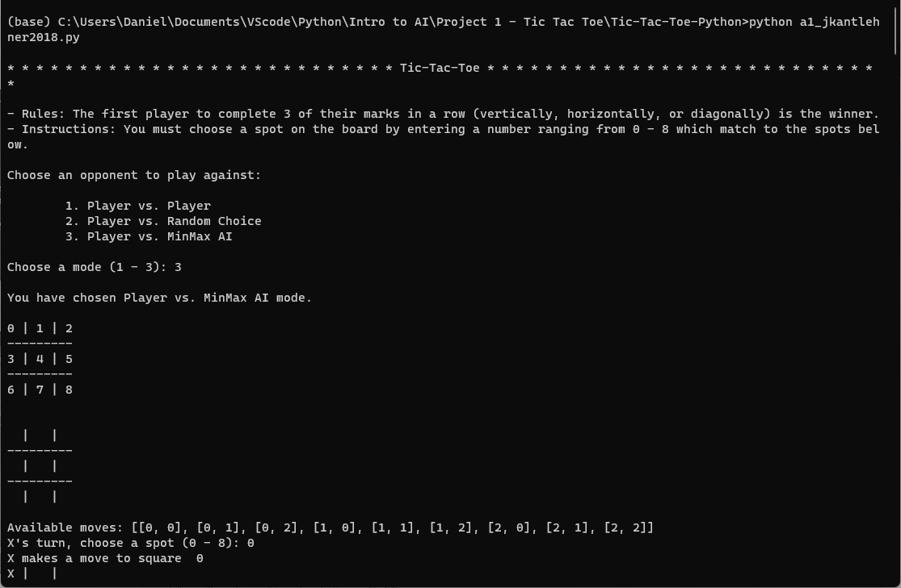

# Project 1: Tic-Tac-Toe

## This is the first project of CAP 4630 Intro to Artificial Intelligence

</br>

__Contributors:__ Daniel Ramirez and John Kantlehner

### __Description__

This project is intended to demonstrate knowledge of adverserial search as well as proficiency using the Python programming language.

### __Goals__
* The app makes it clear the purpose to the user
* Displays the game board
* The user ('X') chooses spot numerically on the board
* The computer controls 'O'
* Repeat previous two steps until draw or winner is determined
* Promtp user to quit or play again

### __Installation instructions__

The game does not require more than having python installed on the machine that will run it

With the command prompt in the directory that the file is contained in you can run our file using:

```xml
python a1_jkantlehner2018.py
```

This command will start the game and would look like the image below.


### __Dependencies__
This project required no special dependencies to run.

</br>

## __Examples__
---

### __Screenshots__

</br>



### __Gif__

</br>


